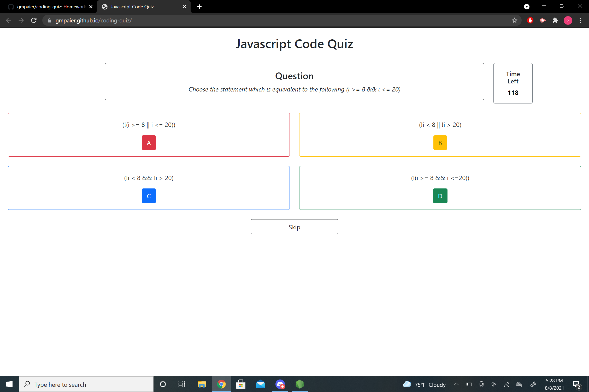

# Coding-Quiz

## Table of Contents

[Description](#description) 

[Installation](#installation) 

[Site Overview](#site-overview) 

[Contributors](#contributors)
 
[Questions](#questions)

## Description

A quiz game application with questions on JavaScript, intended for other bootcamp students and beginning programmers. Answer 10 questions within 2 minutes and log your score upon finishing! Best of luck as some of these questions are tricky. Your highest score will be stored locally, so please note that clearing your cache will erase high score data.

## Installation

[JavaScript Coding Quiz](https://gmpaier.github.io/coding-quiz/)

There is no need to install this application, simply follow the deployed link above.

## Site Overview

On entering the site, the user is presented with three options: Start, Instructions, and High Score. The instructions page displays the game rules. The high score page displays the user's highest score and the initials associated with said score. Start will begin the quiz and the timer. There are 10 multiple choice questions in total. Clicking the correct response will load the next question. Incorrect responses will subtract time off the clock and then disable the incorrect choice, so users cannot click the same wrong answer twice. There is also a skip button, which will send the user to the next question, and put the current question at the end of the queue. Please note that skipping a question will enable previous incorrect choices. Final scores are equal to the amount of time remaining when all questions are answered correctly. Upon completion, the user is prompted to log their initals in an arcade inspired interface.  

## File Structure

index.html: Main file, all quiz functionality. More details about how the quiz functions found through the "rules" button.

assets: holds script.js and style.css, which power and style the main index page.

templates: Contains content used in the creation of the quiz which aren't used directly. Styling for each different page state was done in the associated html files, and the text file of the same name contains a condensed row by row version of the HTML for use in styling functions.

## Questions
Any questions regarding this application can be directed to [Griffin Paier](mailto:gmpaier@loyola.edu).
